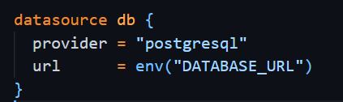
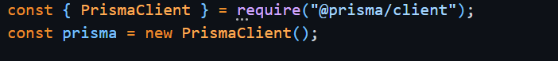
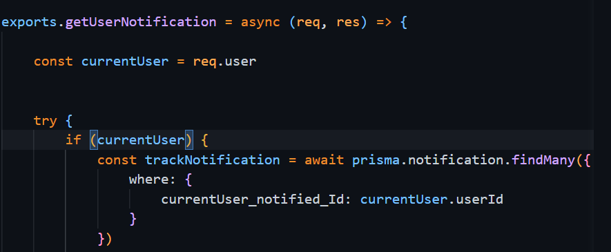

# Learning Project: Worthsec Web App

Worthsec is a social media platform that offers accessibility for diverse groups of people, enabling them to exchange ideas, connect with others, and efficiently manage their events.

 

### Key Features:

- Explore
- Share 
- Chat
- Invite
- Join 
- Search

 
 

 

 # Tech Stack:

 
 
 

### Current Feature State:

- [x] Login - Implemented 
- [x] Sign up  - Implemented
- [x] Create Events - Implemented 
- [x] Search other accounts - Implemented 
- [x] Follow - Implemented 
- [x] Explore events - Implemented  
- [X] Favor - Implemented 
- [ ] Notification - in process 
- [ ] Chat - Not Implemented 
- [ ] Chat - Not Implemented
- [ ] Invite - Not Implemented
- [ ] Share- Not Implemented

## Annotation to data:
This project contains data that the user-generated by interacting with the application. There is no external data involved!
Users can create their events by filling out the form. For this process, they must provide information such as Title, date, time, event - cover, type of event, and more. Furthermore, users can upload a profile picture for their account, which is visible to other users.
Currently, the application has little data because it is still in the development phase. Please note that there are still some tables and attributes missing for the simplicity of the mvp.
### Installation 

## Set up and connect the Database: 

Please be aware that for these common steps that you need to set up nodejs and for the backend microservice framework expressjs. 
After setting up both concepts follow these 5 steps: 

1. Install PostgreSQL from nodejs 
    `npm install pg`

2. Create database server through the dbms pg Admin
     There you can set up your database connection requirement such as user, host, database name, password 
     and port. All of these information can be stored in the env file for security purpose.

    

3. Install the Prisma ORM to connect the express.js backend with the with PostgreSql Database server
    
    1. install the CLI: `npm install -g prisma`
    2. Initialize the prisma project: `prisma init`
    3. During the initialization prisma will ask for some information about the project. Please provide the connection Informaton 
    4. After the configuration, generate a new prisma client: `prisma generate`

4. Set up the Express.js Backend handlerlogic to use prisma client, if the application would like to operate with database table: 

    

Operation Example with the prisma client: 
      
 

## List of Feature:
- User can create an account
- User can login 
- user can sign up 
- user can upload a picture    
- user can create an event 
- user can join an event
- user can follow other users  
- user can search user
- user can favor events 
- user can share events with friends 
- user can receive a notification 
- user can chat

## Conceptual Data Model 

## Physical Data Model 
[![](https://mermaid.ink/img/pako:eNqdVltv2jAU_iuWpb3RigCFkjdEQcuqkaqEPmyZKisxxVtiI9uhY8B_n-0kLA6hpQMJhe9cfL5zi3cwYjGGLsT8jqAXjtKQjsZjfzELdiEF6iMkJ_QFZAJzLwYP9-AEnqEUn6KTFJHkBH1AQrwyHjuWZE0imXGs_E_vc8HcCL7_AHiDqawIRCn4yQhtwpdowzLeJNHnB6wgMrWJKDFlkixJhCRhVcchPYRUfz99AqMoYhmVIEIUCIx4tAJLxgGTK8wByoUCXAFGMZAMpIhuwTGfYL8HV0q2AyXgFk4avGfrhKEYoDI1550y43QPHrxxsHicKKe5bUgLZHcm1U2lPElbqb_gSZmJWqQRx0hioJ5Mqd5nP3maGO65YUjNfzvIY9VVkLagCBLUw8wtAiKTshWJikV_csF2XeKxjrbE7_SfBkd3WEScrHUrjBmVCsmVJEn_GQek3vfAS9ELHrMN5ou8gA2xeHRDJNYR_U9HH4BdA2GKoE1z77r9TObfqMBiPnn84nszk_m5LgWiRR3eUCIipDZoF60Iv1ax5q6qTnUxXqekct4fozUdPfmq5yvEQCOzmh4RJq11iU3wWIcPUgQ2xxpJliTsVS-P4_a4hGfg618V-QoVZSmQhiVTUznd68eleOFO0OjUxI3jfEVWmjxilOJIT86zkEhm4r01-9aSXaENtiwEeF1hqreNtXTLNCoMRBnnehGVIjuhDfmc-YE39cajwPNnZzO6b9IzTVOF7dzWqH4gu4FffU0dmqZDrJB6LVw8HPPPo8fJ-YHf1zX0tIe0gtnUzOnP-enP5NKXidHX6vZQ6C9swRRzdWeI1WXEnBVCVc0Uh9BVjzHiv0KobJQeyiSbb2kEXckz3ILZWu_04voC3SVKhELXiEJ3B39D98pxbq-7nU53MBy2-51h96bTgluN3163-91hezAcOM6g1213Di34hzHlxLluDx2nd9Pv9vo3yr7XgjgmkvGv-XXJ3JrMId-Mvo7k8BfsTwXy?type=png)](https://mermaid.live/edit#pako:eNqdVltv2jAU_iuWpb3RigCFkjdEQcuqkaqEPmyZKisxxVtiI9uhY8B_n-0kLA6hpQMJhe9cfL5zi3cwYjGGLsT8jqAXjtKQjsZjfzELdiEF6iMkJ_QFZAJzLwYP9-AEnqEUn6KTFJHkBH1AQrwyHjuWZE0imXGs_E_vc8HcCL7_AHiDqawIRCn4yQhtwpdowzLeJNHnB6wgMrWJKDFlkixJhCRhVcchPYRUfz99AqMoYhmVIEIUCIx4tAJLxgGTK8wByoUCXAFGMZAMpIhuwTGfYL8HV0q2AyXgFk4avGfrhKEYoDI1550y43QPHrxxsHicKKe5bUgLZHcm1U2lPElbqb_gSZmJWqQRx0hioJ5Mqd5nP3maGO65YUjNfzvIY9VVkLagCBLUw8wtAiKTshWJikV_csF2XeKxjrbE7_SfBkd3WEScrHUrjBmVCsmVJEn_GQek3vfAS9ELHrMN5ou8gA2xeHRDJNYR_U9HH4BdA2GKoE1z77r9TObfqMBiPnn84nszk_m5LgWiRR3eUCIipDZoF60Iv1ax5q6qTnUxXqekct4fozUdPfmq5yvEQCOzmh4RJq11iU3wWIcPUgQ2xxpJliTsVS-P4_a4hGfg618V-QoVZSmQhiVTUznd68eleOFO0OjUxI3jfEVWmjxilOJIT86zkEhm4r01-9aSXaENtiwEeF1hqreNtXTLNCoMRBnnehGVIjuhDfmc-YE39cajwPNnZzO6b9IzTVOF7dzWqH4gu4FffU0dmqZDrJB6LVw8HPPPo8fJ-YHf1zX0tIe0gtnUzOnP-enP5NKXidHX6vZQ6C9swRRzdWeI1WXEnBVCVc0Uh9BVjzHiv0KobJQeyiSbb2kEXckz3ILZWu_04voC3SVKhELXiEJ3B39D98pxbq-7nU53MBy2-51h96bTgluN3163-91hezAcOM6g1213Di34hzHlxLluDx2nd9Pv9vo3yr7XgjgmkvGv-XXJ3JrMId-Mvo7k8BfsTwXy)

