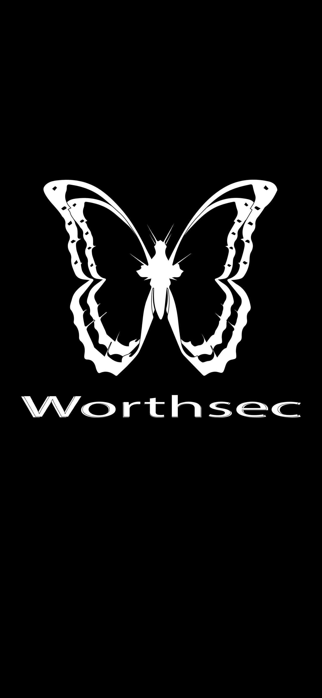
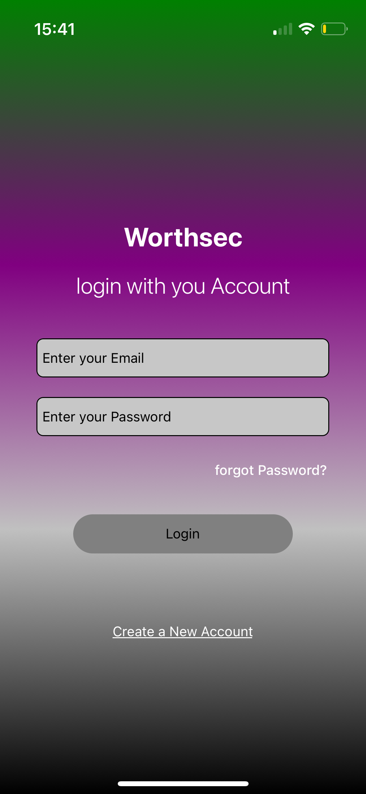
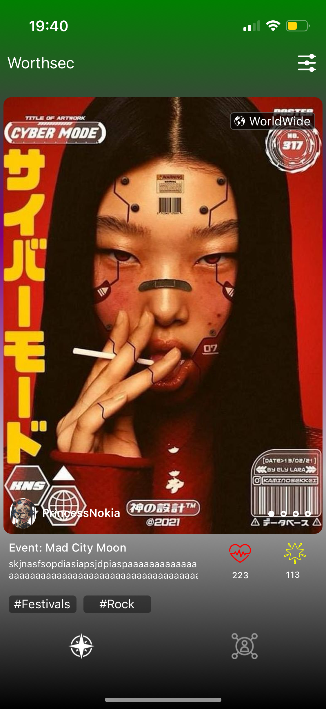
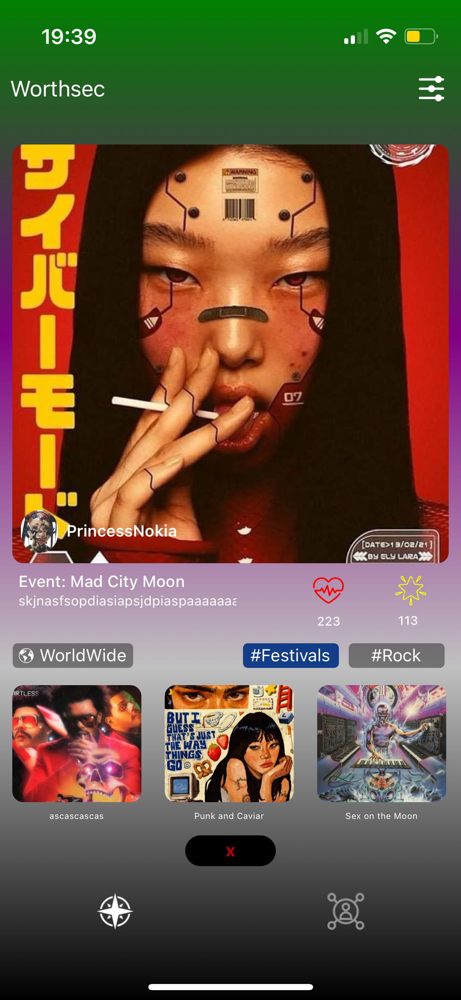
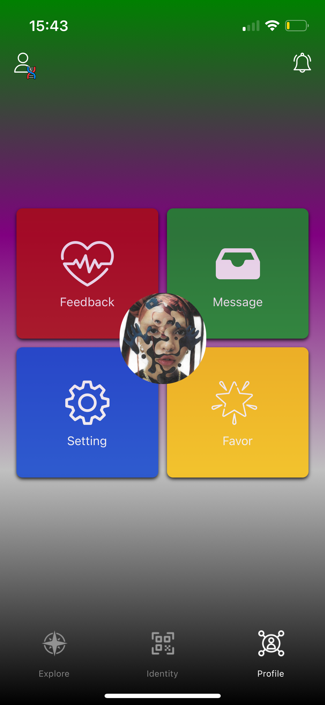
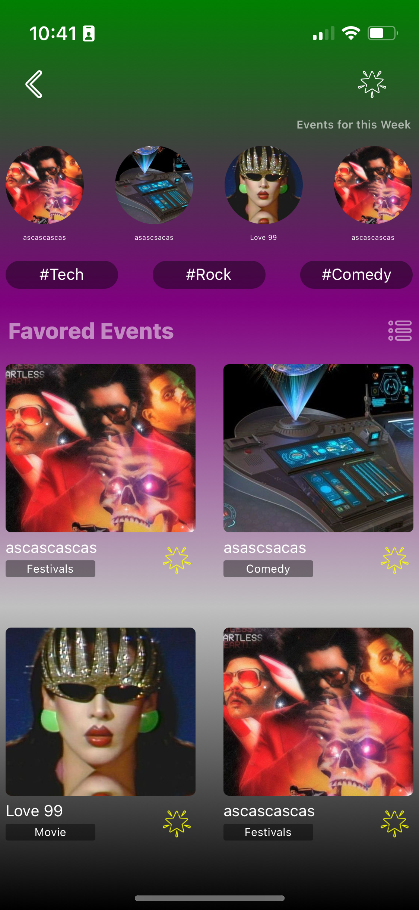
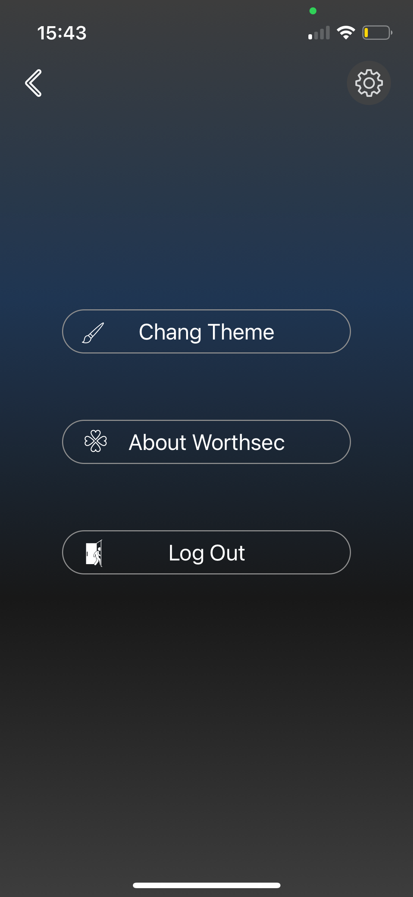
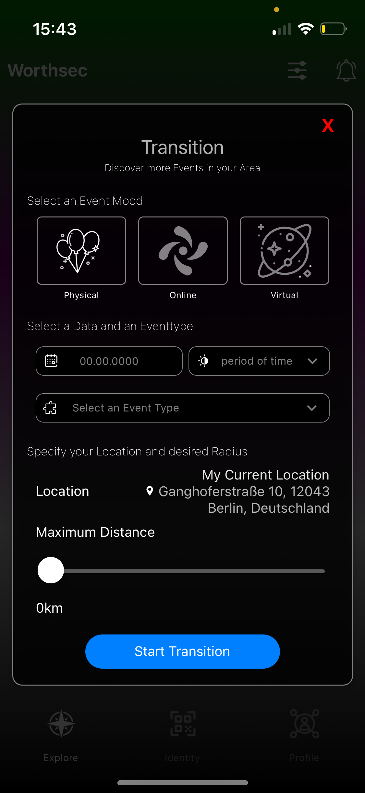
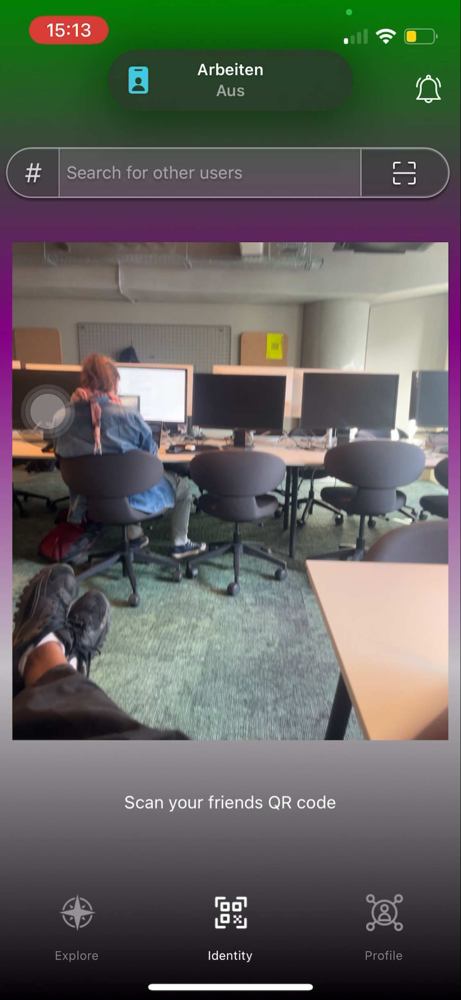
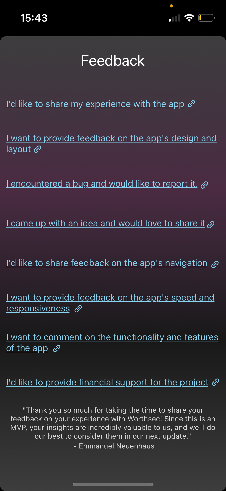

<div align="center">

# Learning Project: Worthsec Web App

</div>


Worthsec is a social media platform for events that offers accessibility for diverse groups of people, enabling them to exchange ideas, connect with others, and efficiently manage their events.

</br>
</br>
</br>


<div style="display: flex; justify-content: space-between; align-items: center; width:100%; flex-wrap: wrap; gap:1px">

 


 


















   

</div>

</br>
</br>
</br>


 <div align="center">

 # Tech Stack:
</div>


<div align="center">

[](https://skillicons.dev)

</div>


</br>
</br>
</br>

### Procedural Instructions - How to set up the backend server 

This guide will help you set up the Worthsec project on your local machine, connect to Git, install dependencies, and start the application. Follow the steps below:

---
</br>
</br>

#### 1. Set Up the Project

1. Visit the Worthsec GitHub repository: [Worthsec Web App Repository](https://github.com/Goldinnovation/Worthsec-Web-App).
2. Clone the repository using the HTTPS URL or download the project zip file.

   **To clone using HTTPS**:
     ```bash
     git clone https://github.com/Goldinnovation/Worthsec-Web-App.git
     ```
3. After cloning, create a new folder for the project on your local machine (if desired), and move the cloned files into this folder.

---

</br>
</br>
</br>

#### 2. Connect with Git

1. Open your terminal and navigate to the project directory.
2. Connect with Git using the clone URL or set up an SSH key for easier access.
3. Create a new branch for testing or development:

   ```bash
   git branch test
   ```
4. Create a new branch for testing or development:
   ```bash
   git checkout test
   ```


</br>


#### 3. Integrate Dependencies

1. Install the required dependencies:
   ```bash
   npm install
   ```


</br>

#### 4. Credentials 
- Contact your Supervisor for credential Information
- Supervisor: Emmanuel Neuenhaus 


#### 5. Start the Application 

1. To start the applicationn, use the following command:
   ```bash
   npm run dev 
   ```


</br>
</br>
</br>


## Client-Server Architecture - Current State:
</br>
<div style="text-align: center;">

 

</div>
</br>
</br>
</br>
